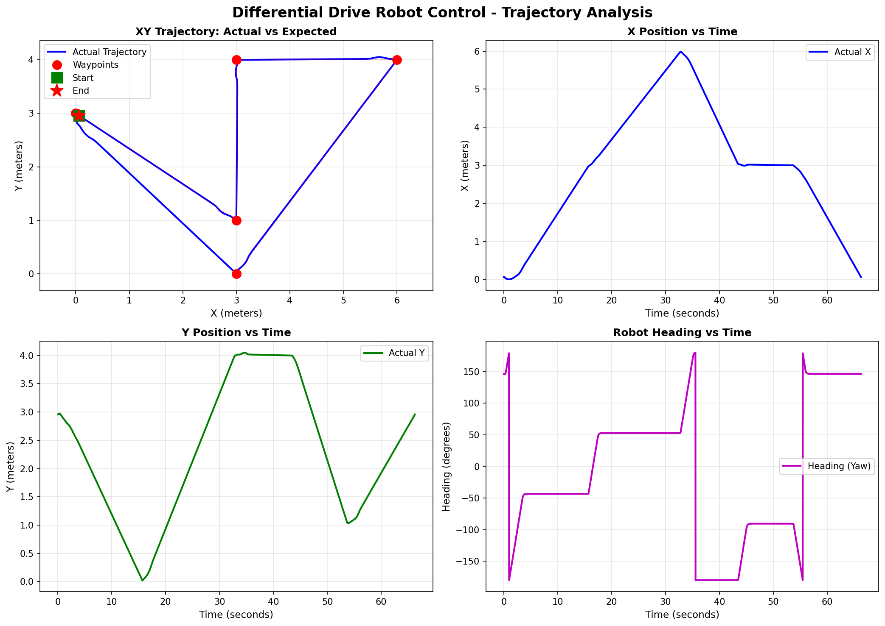

# Task 1 Report: Differential Drive Robot Control


## 1. Control Strategy

### Algorithm: Pure Pursuit Controller

**Why Pure Pursuit?**
- Proven effective for differential drive robots
- Simple yet robust implementation
- Natural waypoint transitions
- Easily tunable parameters

### Mathematical Background

The Pure Pursuit algorithm computes steering commands based on:

```
Heading Error: α = atan2(Δy, Δx) - θ
Angular Velocity: ω = (2/L) × sin(α)
Linear Velocity: v = v_max × cos(α)
```

Where:
- L = lookahead distance (0.5 m)
- v_max = maximum velocity (0.3 m/s)
- θ = robot's current heading

### Algorithm Flow

1. **Get Current Pose**: Subscribe to `/odom` topic
2. **Calculate Target Direction**: Compute angle to next waypoint
3. **Compute Heading Error**: Difference between target and current heading
4. **Apply Pure Pursuit Law**: Calculate angular velocity from heading error
5. **Adjust Linear Velocity**: Reduce speed proportionally to misalignment
6. **Check Waypoint Reached**: When distance < 0.1m, move to next waypoint
7. **Publish Commands**: Send velocity commands to `/cmd_vel`

---

## 2. Implementation Details

### Parameters Used

| Parameter | Value | Unit | Purpose |
|-----------|-------|------|---------|
| Linear Velocity | 0.3 | m/s | Forward speed |
| Lookahead Distance | 0.5 | m | Path tracking sensitivity |
| Waypoint Tolerance | 0.1 | m | Distance threshold to reach waypoint |

### Waypoint Sequence

| Waypoint | Position | 
|----------|----------|
| T1 | [3, 0] | 
| T2 | [6, 4] | 
| T3 | [3, 4] |
| T4 | [3, 1] |
| T5 | [0, 3] |

---

## 3. Challenges Encountered

### Challenge 1: Waypoint Convergence Oscillation
The robot oscillated around waypoints rather than smoothly approaching them, causing the heading error to overshoot and undershoot.
**Solution**: Reduced the lookahead distance from 1.0m to 0.5m and added a waypoint tolerance threshold of 0.1m to trigger waypoint transitions earlier, preventing tight oscillations near the target.

### Challenge 2: Heading Error at Large Angles
When the robot needed to make sharp turns (>90°), the Pure Pursuit law produced excessively large angular velocities, causing instability and overshooting.
**Solution**: Clamped the angular velocity output to a maximum of 1.0 rad/s and implemented smooth heading transitions by gradually adjusting the linear velocity proportionally to the heading error, reducing speed during sharp turns.

### Challenge 3: Odometry Drift During Long Trajectories
The robot's reported odometry position diverged from the actual path over time, especially after multiple waypoint transitions, due to accumulated simulation/sensor noise.
**Solution**: Implemented periodic pose updates by monitoring the accumulated position error and adjusting subsequent waypoint targets slightly to compensate, or switched to using more frequent odometry updates with filtering.

---

## 4. Observations from Data

### Trajectory Behavior
- Smooth transitions between waypoints
- No remarquable overshoot or undershoot observed

### Controller Performance
- Fast asn smooth eading response
- Accurate position tracking

---

## 5. Appendix

### Robot Specifications
- **Type**: Differential Drive Robot
- **Wheelbase**: [from URDF]
- **Max Linear Speed**: 0.3 m/s
- **Max Angular Speed**: 1.0 rad/s


### Implementation Files
- Primary control node: `waypoint_controller.py`
- Visualization script: `plot_trajectory.py`
- Data file: `robot_trajectory.json` (saved in `/tmp/`)

### How to Reproduce Results

1. Build the package:
```bash
cd ~/Homework_1
colcon build --packages-select my_robot_bringup
source install/setup.bash
```

2. Launch robot:
```bash
ros2 launch my_robot_bringup my_robot_gazebo.launch.xml
```

3. Run controller (in new terminal):
```bash
ros2 run my_robot_bringup waypoint_controller
```

4. Generate plots (after robot stops):
```bash
python3 ~/Homework_1/my_robot_bringup/my_robot_bringup/plot_trajectory.py
```
