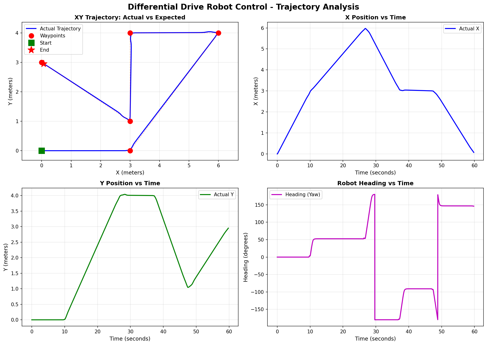
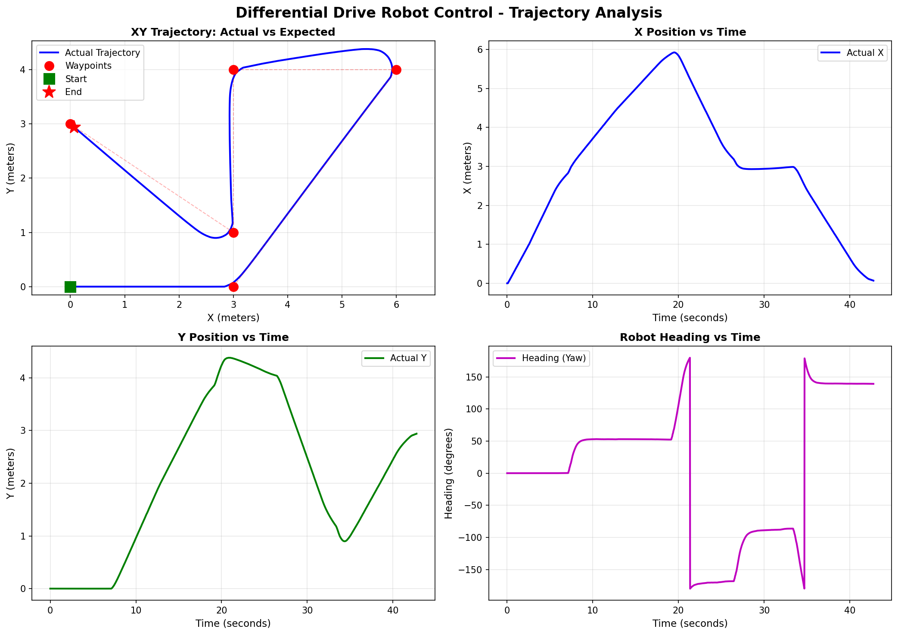
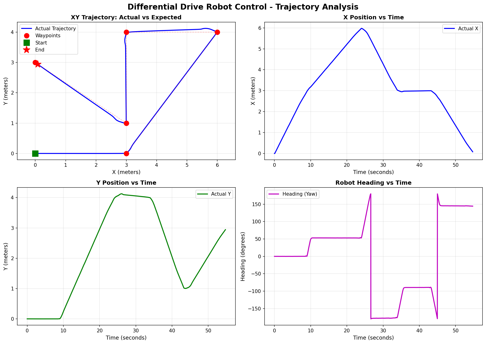
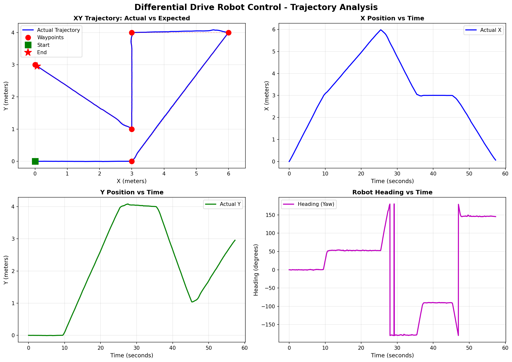

# Task 1 Report: Differential Drive Robot Control


## 1. Control Strategy

### Pure Pursuit
- Steers using heading error to the active waypoint.

### P Controller (Proportional)
- Uses proportional distance for linear speed and proportional heading error for angular speed.

### Stanley
- Combines heading alignment and cross-track correction relative to the current path segment.
- Better path-centering behaviour, especially when the robot drifts off the segment.

### MPC (Sampling-Based)
- Samples control rollouts over a short horizon, predicts future states, and selects the first control from the best rollout.
- More flexible but more sensitive to horizon length, weights, and sampling bounds.

---

## 2. Implementation Details

### Parameters Used

| Parameter | Value | Unit | Purpose |
|-----------|-------|------|---------|
| Linear Velocity | 0.3 | m/s | Forward speed |
| Lookahead Distance | 0.5 | m | Path tracking sensitivity |
| Waypoint Tolerance | 0.1 | m | Distance threshold to reach waypoint |

### Waypoint Sequence

| Waypoint | Position | 
|----------|----------|
| T1 | [3, 0] | 
| T2 | [6, 4] | 
| T3 | [3, 4] |
| T4 | [3, 1] |
| T5 | [0, 3] |

---

## 3. Challenges Encountered

### Challenge 1: Trade-off Between Fast Convergence and Smooth Motion
All controllers needed tuning to avoid the same issue: either approaching waypoints too slowly or overshooting them.

**What was done:**
- Reduced speed near waypoints.
- Limited angular commands.
- Used conservative default gains/weights.

### Challenge 2: MPC Looping/Revisiting Nearby Waypoints
Compared to the other controllers, MPC initially showed repeated passes near the same waypoint region.

**Main reason:**
- Prediction horizon and cost weighting were not balanced enough, so local rollouts could prefer short-term improvements that looked unstable globally.

**What was done:**
- Increased planning horizon quality.
- Rebalanced position/heading/control penalties.
- Added smoother behaviour near waypoint transitions.

---

## 4. Observations from Data
### Pure Pursuit Plot


### P Controller Plot


### Stanley Plot


### MPC Plot


### Behaviour Comparison
- **Pure Pursuit:** smooth and predictable on most segments with slight corner-cutting on sharp transitions.
- **P Controller:** reaches waypoints reliably but shows larger overshoot/oscillation if heading error is high.
- **Stanley:** strongest path adherence
- **MPC:** best potential smoothness after tuning, but also the most sensitive to parameter choices.

### General Findings
- P and Pure Pursuit are easier to tune and debug.
- Stanley gives solid geometric path tracking.
- MPC can outperform others only when horizon and cost terms are tuned carefully.

---

## 5. Appendix

### Robot Specifications
- **Type**: Differential Drive Robot
- **Wheelbase**: [from URDF]
- **Max Linear Speed**: 0.3 m/s
- **Max Angular Speed**: 1.0 rad/s


### Implementation Files
- `my_robot_controllers/pure_pursuit_controller.py`
- `my_robot_controllers/p_controller.py`
- `my_robot_controllers/stanley_controller.py`
- `my_robot_controllers/mpc_controller.py`
- Visualization script: `plot_trajectory.py`

### How to Reproduce Results

1. Build the package:
```bash
cd ~/Homework_1
colcon build --packages-select my_robot_bringup
source install/setup.bash
```

2. Launch robot:
```bash
ros2 launch my_robot_bringup my_robot_gazebo.launch.xml
```

3. Run controller (in new terminal):
```bash
ros2 run my_robot_bringup waypoint_controller
```

4. Generate plots (after robot stops):
```bash
python3 ~/Homework_1/my_robot_bringup/my_robot_bringup/plot_trajectory.py
```
